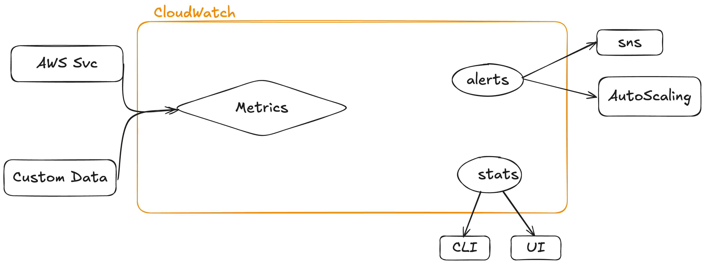

### CloudWatch

- Collects and manages operational data
### Metrics
- Metrics - AWS Products, Apps, on-premises
- Can be used either on AWS or on other clouds
- Some metrics are gathered natively by the producs (i.e cpu usage on EC2)
- You can use CloudWatch agent to monitor things outside AWS
- CW Agent can also be used to gather additional data inside AWS services

### UI, CLI, Api exposed

### Logging
- Also AWS Products, Apps and On-Premises
- Cloudwatch agent approach as well

### Events
- AWS Services & Schedules
- Sends events when things happen i.e EC2 instance created, events can trigger additional actions

### Namespaces
- Separate data between namespaces
- All AWS data goes to AWS/Service namespace, example AWS/EC2
- AWS/* Is reserved for AWS, you can't create a namespace like that
- Metrics - collection of related resources over time, time-ordered

### Datapoints
- Every measurement is called a datapoint
- Two things: timestamp, value

### Dimensions
- Dimensions separate datapoints for different things or perspectives within same metric
- Example - Name=instanceId, Value=i-xxxxx

### Alarm
- Created and linked to a specific metric
- Takes action based on that metric
- In case of alarm: sends notification through SNS or triggers complex logic
