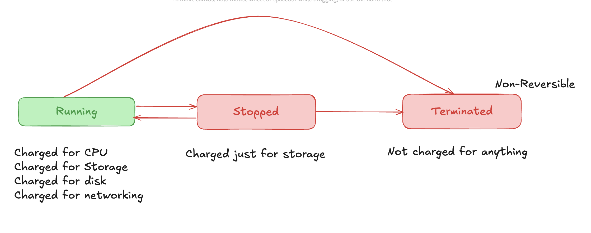

### EC2 - Elastic Compute Cloud
- Provides access to instances - Compute
- IAAS - Infrastructure as a Service
- Provides VMs - Instances
- Private by default - uses VPC networking
- EC2 instance is configured to a specific subnet
- EC2 is AZ resillient
- Can choose different sizes and capabilities:
    - Storage, GPUs, specialized for DBs, networking
- On-Demand billing - per second or per hour
- Different charges - resources, storage, extra charge for software used
- Local on-host storage or EBS (Elastic Block Store - network storage)

### Instance Lifecycle
- Running
- Stopped
- Terminated

### AMI - Amazon Machine Image
- Can create a EC2 instance or an AMI can be created based from an EC2 image
- Similar to a VM image
- AMI has permissions - accounts that can use AMI, public or private
- AMI has root volume - boot volume
- AMI has block device mapping - links volumes and the OS, determines which volume is boot and which is data
- Connecting to EC2 is done through SSH with a private/public key pair.

