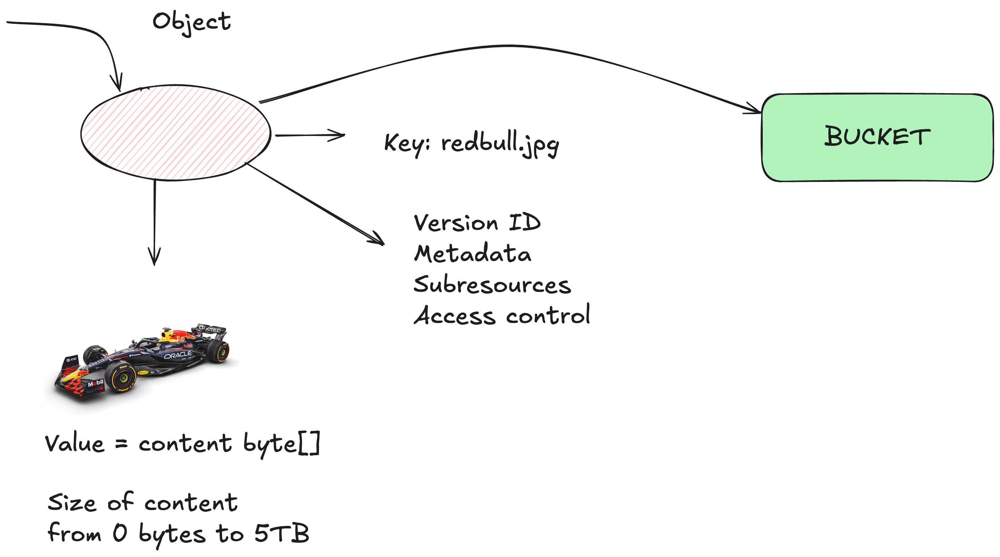
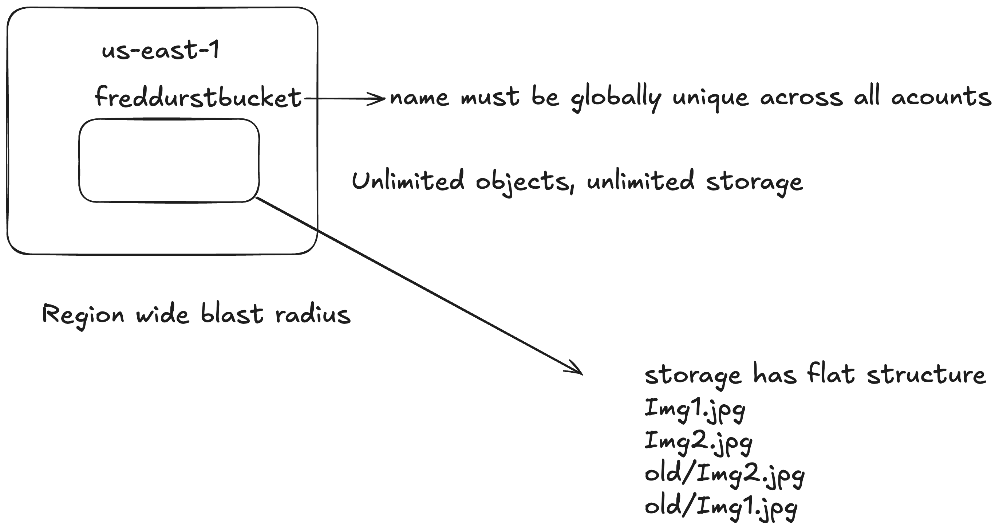

### S3

## Global Storage - can be accessed anywhere
### Region based - data stored at rest at a specific region
### Replication across AZs

#### Public service - runs on AWS public zone

#### Designed for multi-user access.

#### Great for hosting large data, movies, audio, images, big texts

### Cheap

#### Acces methods - GUI, CLI, API, HTTP

## Objects
- Data that S3 stores, like image, video, etc

## Buckets
- Are the containers for objects

- Name must be globally unique
- Name between 3-63 characters, all lowercase, no underscores
- Can't be IP formatted
- Buckets - 100 soft per account, if you raise requests you can have up to 1000 per account
- Unlimited objects per bucket, each object can go from 0bytes to 5TB
- Key=name, Value=data