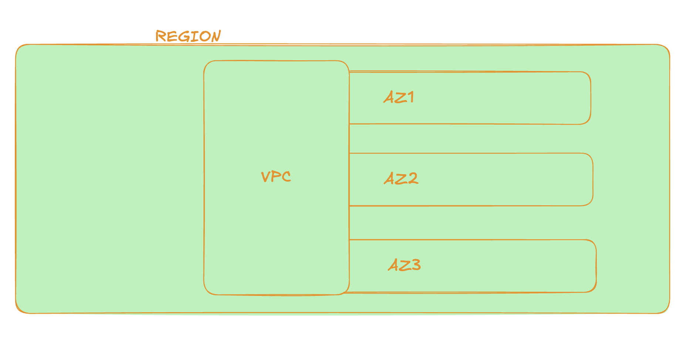

## Site: infrastructure.aws

### Region
- Geoseparation - geographic and geopolitical - local laws affect regions
- Location control - close infrastructure allows more performance

### Globally resillient
- Natural cross-region replication, examples IAM and Route53

### Region resillient
- Operate in each region, replicate to multiple AZs, for example RDS

### AZ resillient
- Runs on each AZ, if AZ fails software fails, example EC2

